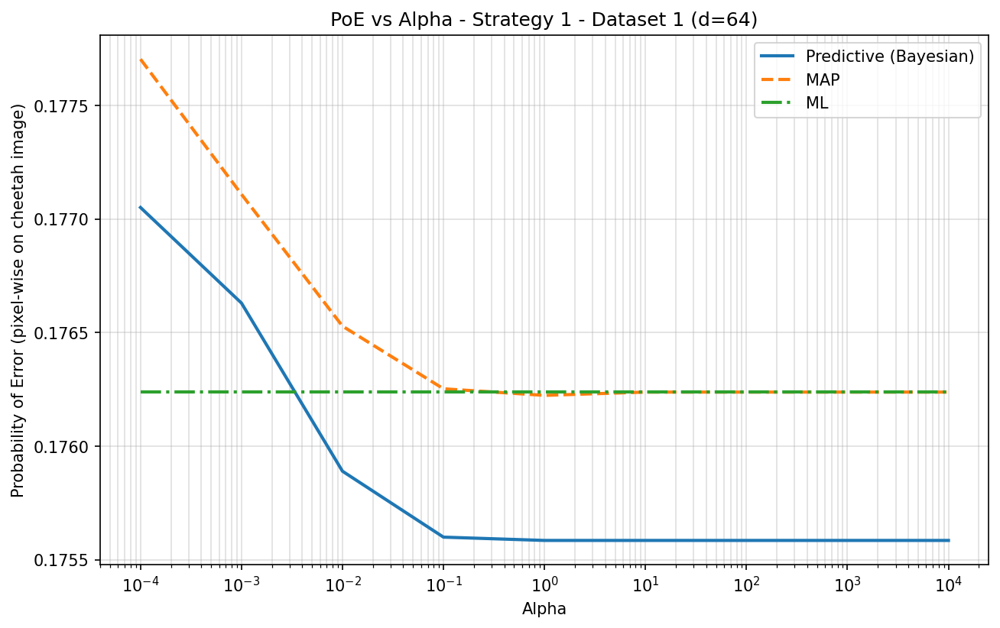
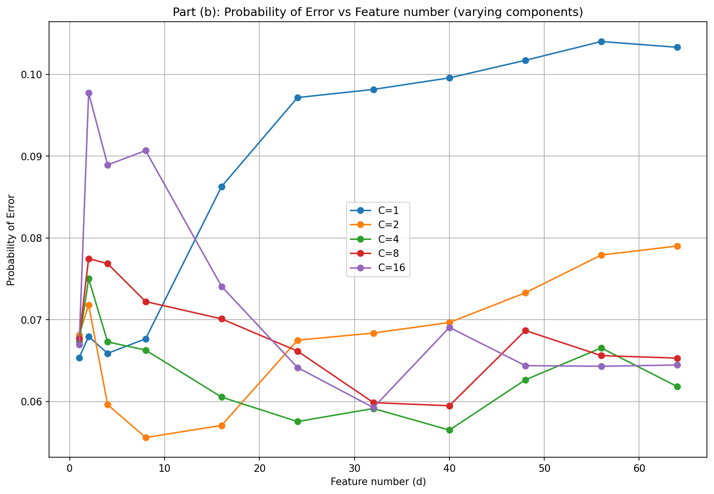

# Statistical Learning & Pattern Recognition Projects

This repository contains a series of projects completed for UCSD's ECE 271A: Statistical Learning I course. The projects demonstrate the practical implementation of fundamental machine learning algorithms for tasks such as image segmentation, classification, and density estimation.

## Core Competencies Demonstrated

-   **Classification:** Bayesian Decision Theory, Gaussian Classifiers (ML, Bayesian), K-Nearest Neighbors
-   **Parameter Estimation:** Maximum Likelihood (MLE), Maximum A Posteriori (MAP), Bayesian Predictive Densities
-   **Dimensionality Reduction:** Principal Component Analysis (PCA), Fisher's Linear Discriminant Analysis (LDA)
-   **Clustering & Latent Variables:** Gaussian Mixture Models (GMM), Expectation-Maximization (EM) Algorithm
-   **Model Evaluation:** Bias-Variance Tradeoff, Error Rate Calculation, Confusion Matrices

## Technology Stack

-   **Primary:** Python, NumPy, SciPy, Matplotlib, imageio, Matlab

-----

## Project Showcase

This table provides a high-level overview of each project. Click on the project name to jump to the detailed section.

| Project                                                              | Core Concepts Applied                             | Key Result Metric        |
| -------------------------------------------------------------------- | ------------------------------------------------- | ------------------------ |
| [**HW1: Bayesian Classifier for Image Segmentation**](#hw1-bayesian-classifier-for-image-segmentation) | Bayesian Decision Theory, DCT Feature Extraction  | **Error Rate: 17.27%** |
| [**HW2: Gaussian Classifiers for Segmentation**](#hw2-gaussian-classifiers-for-segmentation) | Multivariate Gaussians, MLE, Feature Selection (KL Divergence) | **Error Rate: 7.48%** |
| [**HW3: Bayesian Parameter Estimation**](#hw3-bayesian-parameter-estimation) | MAP, Bayesian Predictive, Conjugate Priors        | **Error Rate: ~11.69%** |
| [**HW4: Mixture Models & EM**](#hw4-mixture-models--em)              | Gaussian Mixture Models, Expectation-Maximization | **Error Rate: ~11.50%** |

-----

## Project Details

### HW1: Bayesian Classifier for Image Segmentation

-   **Objective:** To build a classifier that segments an image into "cheetah" (foreground) and "grass" (background) classes using Bayesian Decision Theory.

-   **Methodology:**
    1.  **Feature Extraction:** The image was processed with a sliding 8x8 window. For each block, the Discrete Cosine Transform (DCT) was computed. The feature was the index (1-64) of the DCT coefficient with the second-largest magnitude, capturing the block's dominant frequency component.
    2.  **Probability Estimation:** Class priors `P(Y)` were estimated from sample counts. Class-conditional likelihoods `P(X|Y)` were modeled as normalized histograms of the features, with Laplace smoothing applied for robustness.
    3.  **Classification:** The Bayes Decision Rule for minimum error was applied to classify the center pixel of each 8x8 block. A full-size segmentation mask was generated, and boundary pixels were filled using nearest-neighbor interpolation.
    4.  **Evaluation:** The final mask was compared against a ground truth to calculate the probability of error, a confusion matrix, precision, and recall.

-   **Result:**
    -   **Probability of Error:** **17.27%**
    -   **Performance Analysis Visualization:** The figure below shows the generated mask, the ground truth, and a color-coded map of classification errors (False Positives in red, False Negatives in blue).

      

-   **File Structure for HW1:**
    -   `hw1_solution.ipynb`: Jupyter Notebook with the complete implementation and analysis.
    -   `cheetah.bmp`: The input test image.
    -   `cheetah_mask.bmp`: The ground-truth mask for error calculation.
    -   `TrainingSamplesDCT_8.mat`: Training data containing DCT coefficients.
    -   `Zig-Zag Pattern.txt`: The scanline order for converting 8x8 DCT matrices to 64x1 vectors.

### HW2: Gaussian Classifiers for Segmentation

-   **Objective:** To extend the Bayesian classifier by modeling class-conditional densities as Multivariate Gaussian distributions and to demonstrate the "Curse of Dimensionality" by comparing a 64-dimensional model against a reduced 8-dimensional model.

-   **Methodology:**
    1.  **Gaussian Modeling (MLE):** The class-conditional densities `P(X|Y)` were assumed to be multivariate Gaussian. The Mean vectors ($\mu$) and Covariance matrices ($\Sigma$) were estimated using Maximum Likelihood Estimation (MLE) on the training data.
    2.  **Feature Selection:** The Symmetric Kullback-Leibler (KL) Divergence was calculated for all 64 features to quantify their discriminative power. The top 8 features were selected to build a low-dimensional classifier.
    3.  **Classification:** A sliding window approach was used. Pixels were classified using the Bayesian Decision Rule, implemented via log-likelihood functions for numerical stability.
    4.  **Comparison:** Two classifiers were evaluated: one using the full 64-dimensional feature vector and one using only the best 8 features.

-   **Result:**
    -   **64D Error Rate:** 14.50% (High False Positives due to overfitting).
    -   **8D Error Rate:** **7.48%** (Best Performance).
    -   **Insight:** The 8D classifier was better than the 64D classifier. This confirms the Curse of Dimensionality: estimating a full $64 \times 64$ covariance matrix (2080 parameters) with limited data leads to poor generalization, whereas the simpler 8D model (36 parameters) is more robust.

      

-   **File Structure for HW2:**
    -   `hw2_solution.py`: Python script for MLE parameter estimation, KL divergence calculation, and image classification. 
    -   `output/`: Directory containing generated plots, including marginal densities and segmentation masks.
    -   `TrainingSamplesDCT_8_new.mat`: Updated training data for Gaussian estimation.
### HW3: Bayesian Parameter Estimation

-   **Objective:** To explore Bayesian Parameter Estimation by treating the class-conditional mean $\mu$ as a random variable rather than a fixed constant. This project compares the performance of Maximum Likelihood (ML), Maximum A Posteriori (MAP), and Bayesian Predictive estimators across varying dataset sizes ($N$) and prior uncertainties ($\alpha$).

-   **Methodology:**
    1.  **Model Setup:** Class-conditional densities were modeled as multivariate Gaussians with known covariance (approximated by the sample covariance of each training subset) but unknown mean.
    2.  **Prior Distribution:** A Gaussian prior $P(\mu) \sim \mathcal{N}(\mu_0, \Sigma_0)$ was applied to the mean, where $\Sigma_0 = \alpha\,\mathrm{diag}(W_0)$.
    3.  **Estimator Comparison:**
        * **ML:** Uses the training-set sample mean for each class.
        * **MAP:** Uses the posterior mean $\mu_n$ as a plug-in estimate.
        * **Bayesian Predictive:** Uses the predictive covariance $\Sigma + \Sigma_n$ to account for posterior uncertainty in $\mu$.
    4.  **Decision Rule vs. Evaluation Convention:**
        * **Class priors in the decision rule:** ML-estimated from the training subset (dataset-dependent).
        * **Probability of Error (PoE):** Computed on the *cheetah test image* as the **pixel-wise misclassification rate** using the ground-truth mask.
    5.  **Strategies:** Tested two prior strategies provided by the starter files:
        * **Strategy 1:** Prior mean closer to the ML means (more informative).
        * **Strategy 2:** Prior mean farther from the ML means (less informative / poorer prior).

-   **Result:**
    -   **Convergence behavior:** As $\alpha$ becomes large, both MAP and Bayesian Predictive curves converge to the ML baseline (the prior becomes effectively uninformative).
    -   **Prior sensitivity:** For small $\alpha$, MAP/Predictive performance can improve or degrade relative to ML depending on how well the prior mean aligns with the test-image distribution and the dataset size.
    -   **Representative curve (Strategy 1, Dataset 1, $d=64$):**

      

-   **File Structure for HW3:**
    -   `hw3/hw3_solution.py`: Final implementation that generates the PoE-vs-alpha curves (saved with suffix `_d64.png`).
    -   `hw3/output/`: Contains plots for both strategies and all datasets:

### HW4: Mixture Models & EM Algorithm

-   **Objective:** To implement a Gaussian Mixture Model (GMM) classifier using the Expectation-Maximization (EM) algorithm. This project investigates how random initialization affects convergence and how the number of mixture components ($C$) impacts classification error.

-   **Methodology:**
    1.  **GMM Training (EM):** For both foreground and background classes, densities were modeled as mixtures of multivariate Gaussians with *diagonal* covariance matrices.
    2.  **Initialization Sensitivity (Part A):** Trained 5 different models per class (random initialization) with $C=8$ components to observe the variance in error rates due to local maxima in the EM likelihood surface.
    3.  **Model Complexity (Part B):** Trained models with component counts $C \in \{1, 2, 4, 8, 16, 32\}$ to analyze the trade-off between model flexibility and overfitting.
    4.  **Evaluation:** Probability of Error (PoE) was plotted against the number of feature dimensions (1 to 64).

-   **Result:**
    -   **Initialization:** The error rates varied noticeably between different random initializations, confirming that EM is sensitive to starting parameters and can get stuck in local optima.
    -   **Component Complexity:** Surprisingly, simpler models ($C=1$) performed remarkably well (~11.5% error) on this specific test set. Increasing complexity to $C=32$ did not monotonically decrease error, likely due to the diagonal covariance constraint effectively capturing the data variance without needing many components, or potential overfitting on the 64-dimensional space.

      

-   **File Structure for HW4:**
    -   `hw4_solution.py`: Python script implementing the custom GMM-EM class and performing the experiments.
    -   `hw4/output/`: Contains the plots for initialization sensitivity and component analysis.