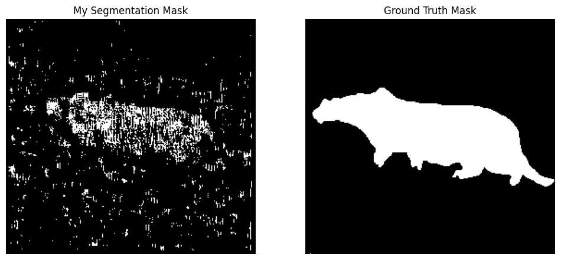

# Statistical Learning & Pattern Recognition Projects

This repository contains a series of projects completed for UCSD's ECE 271A: Statistical Learning I course. The projects demonstrate the practical implementation of fundamental machine learning algorithms for tasks such as image segmentation, classification, and density estimation.

## Core Competencies Demonstrated

  * **Classification:** Bayesian Decision Theory, Gaussian Classifiers (ML, Bayesian), K-Nearest Neighbors
  * **Dimensionality Reduction:** Principal Component Analysis (PCA), Fisher's Linear Discriminant Analysis (LDA)
  * **Density Estimation:** Parametric (MLE, Bayesian Estimation) and Non-Parametric (Kernel Density) Methods
  * **Clustering & Latent Variables:** Gaussian Mixture Models (GMM), Expectation-Maximization (EM) Algorithm
  * **Model Evaluation:** Bias-Variance Tradeoff, Error Rate Calculation, Cross-Validation

## Technology Stack

  * **Primary:** Python, NumPy, SciPy, Matplotlib, imageio, Matlab

-----

## Project Showcase

This table provides a high-level overview of each project. Click on the project name to jump to the detailed section.

| Project | Core Concepts Applied | Key Result Metric |
| --- | --- | --- |
| [**HW1: Bayesian Classifier for Image Segmentation**](#hw1-bayesian-classifier-for-image-segmentation) | Bayesian Decision Theory, DCT Feature Extraction | **Error Rate: 16.80%** |
| **HW2: Gaussian Classifiers** *(Details to be added)* | Maximum Likelihood Estimation (MLE), Covariance Analysis | Classification Accuracy |
| **HW3: Dimensionality Reduction** *(Details to be added)* | PCA, Fisher's LDA | Visualization, Separation |
| **HW4: Non-Parametric Methods** *(Details to be added)* | K-Nearest Neighbors, Kernel Density Estimation | Classification Accuracy |
| **HW5: Mixture Models & EM** *(Details to be added)* | Gaussian Mixture Models, Expectation-Maximization | Log-Likelihood, Clustering |

-----

## Project Details

### HW1: Bayesian Classifier for Image Segmentation

  * **Objective:** To build a classifier that segments an image into "cheetah" (foreground) and "grass" (background) classes using Bayesian Decision Theory.

  * **Methodology:**
    1. The image was decomposed into 8x8 pixel blocks using a sliding window.
    2. The Discrete Cosine Transform (DCT) was applied to each block to convert spatial information into the frequency domain, which is more effective for texture discrimination.
    3. A single, powerful feature was engineered for each block: the index of the second-largest DCT coefficient, representing the dominant non-DC frequency component.
    4. Class priors `P(Y)` and class-conditional likelihoods `P(X|Y)` were estimated from a provided training dataset. Likelihoods were modeled using normalized histograms.
    5. The Minimum Probability of Error decision rule, implemented using log-posteriors for numerical stability, was applied to classify each block and generate a segmentation mask.

  * **Result:**
    * **Probability of Error:** **16.80%**
    * **Generated Segmentation Mask vs. Ground Truth:**

      

  * **File Structure for HW1:**
    * `hw1_solution.ipynb`: Main Jupyter Notebook containing the entire analysis and implementation pipeline.
    * `cheetah.bmp`: The input test image.
    * `cheetah_mask.bmp`: The ground-truth mask for error calculation.
    * `TrainingSamplesDCT_8.mat`: Training data containing DCT coefficients for foreground and background.
    * `Zig-Zag Pattern.txt`: The scanline order for converting 8x8 DCT matrices to 64x1 vectors.
