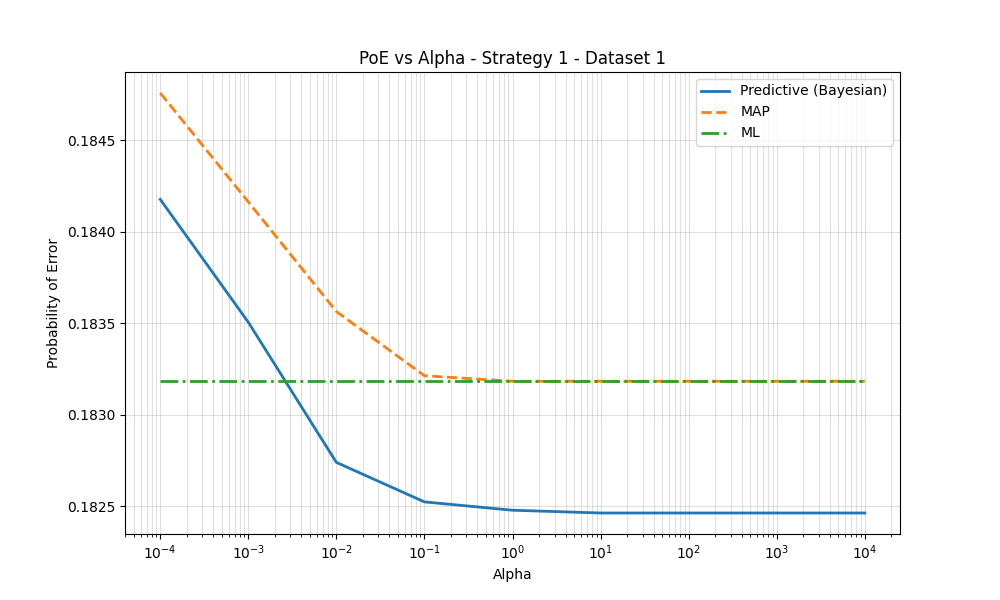

# Statistical Learning & Pattern Recognition Projects

This repository contains a series of projects completed for UCSD's ECE 271A: Statistical Learning I course. The projects demonstrate the practical implementation of fundamental machine learning algorithms for tasks such as image segmentation, classification, and density estimation.

## Core Competencies Demonstrated

-   **Classification:** Bayesian Decision Theory, Gaussian Classifiers (ML, Bayesian), K-Nearest Neighbors
-   **Parameter Estimation:** Maximum Likelihood (MLE), Maximum A Posteriori (MAP), Bayesian Predictive Densities
-   **Dimensionality Reduction:** Principal Component Analysis (PCA), Fisher's Linear Discriminant Analysis (LDA)
-   **Clustering & Latent Variables:** Gaussian Mixture Models (GMM), Expectation-Maximization (EM) Algorithm
-   **Model Evaluation:** Bias-Variance Tradeoff, Error Rate Calculation, Confusion Matrices

## Technology Stack

-   **Primary:** Python, NumPy, SciPy, Matplotlib, imageio, Matlab

-----

## Project Showcase

This table provides a high-level overview of each project. Click on the project name to jump to the detailed section.

| Project                                                              | Core Concepts Applied                             | Key Result Metric        |
| -------------------------------------------------------------------- | ------------------------------------------------- | ------------------------ |
| [**HW1: Bayesian Classifier for Image Segmentation**](#hw1-bayesian-classifier-for-image-segmentation) | Bayesian Decision Theory, DCT Feature Extraction  | **Error Rate: 17.27%** |
| [**HW2: Gaussian Classifiers for Segmentation**](#hw2-gaussian-classifiers-for-segmentation) | Multivariate Gaussians, MLE, Feature Selection (KL Divergence) | **Error Rate: 7.48%** |
| [**HW3: Bayesian Parameter Estimation**](#hw3-bayesian-parameter-estimation) | MAP, Bayesian Predictive, Conjugate Priors        | **PoE vs. Prior Uncertainty**|
| **HW4: Non-Parametric Methods** *(Details to be added)* | K-Nearest Neighbors, Kernel Density Estimation    | Classification Accuracy  |
| **HW5: Mixture Models & EM** *(Details to be added)* | Gaussian Mixture Models, Expectation-Maximization | Log-Likelihood, Clustering |

-----

## Project Details

### HW1: Bayesian Classifier for Image Segmentation

-   **Objective:** To build a classifier that segments an image into "cheetah" (foreground) and "grass" (background) classes using Bayesian Decision Theory.

-   **Methodology:**
    1.  **Feature Extraction:** The image was processed with a sliding 8x8 window. For each block, the Discrete Cosine Transform (DCT) was computed. The feature was the index (1-64) of the DCT coefficient with the second-largest magnitude, capturing the block's dominant frequency component.
    2.  **Probability Estimation:** Class priors `P(Y)` were estimated from sample counts. Class-conditional likelihoods `P(X|Y)` were modeled as normalized histograms of the features, with Laplace smoothing applied for robustness.
    3.  **Classification:** The Bayes Decision Rule for minimum error was applied to classify the center pixel of each 8x8 block. A full-size segmentation mask was generated, and boundary pixels were filled using nearest-neighbor interpolation.
    4.  **Evaluation:** The final mask was compared against a ground truth to calculate the probability of error, a confusion matrix, precision, and recall.

-   **Result:**
    -   **Probability of Error:** **17.27%**
    -   **Performance Analysis Visualization:** The figure below shows the generated mask, the ground truth, and a color-coded map of classification errors (False Positives in red, False Negatives in blue).

      

-   **File Structure for HW1:**
    -   `hw1_solution.ipynb`: Jupyter Notebook with the complete implementation and analysis.
    -   `cheetah.bmp`: The input test image.
    -   `cheetah_mask.bmp`: The ground-truth mask for error calculation.
    -   `TrainingSamplesDCT_8.mat`: Training data containing DCT coefficients.
    -   `Zig-Zag Pattern.txt`: The scanline order for converting 8x8 DCT matrices to 64x1 vectors.

### HW2: Gaussian Classifiers for Segmentation

-   **Objective:** To extend the Bayesian classifier by modeling class-conditional densities as Multivariate Gaussian distributions and to demonstrate the "Curse of Dimensionality" by comparing a 64-dimensional model against a reduced 8-dimensional model.

-   **Methodology:**
    1.  **Gaussian Modeling (MLE):** The class-conditional densities `P(X|Y)` were assumed to be multivariate Gaussian. The Mean vectors ($\mu$) and Covariance matrices ($\Sigma$) were estimated using Maximum Likelihood Estimation (MLE) on the training data.
    2.  **Feature Selection:** The Symmetric Kullback-Leibler (KL) Divergence was calculated for all 64 features to quantify their discriminative power. The top 8 features were selected to build a low-dimensional classifier.
    3.  **Classification:** A sliding window approach was used. Pixels were classified using the Bayesian Decision Rule, implemented via log-likelihood functions for numerical stability.
    4.  **Comparison:** Two classifiers were evaluated: one using the full 64-dimensional feature vector and one using only the best 8 features.

-   **Result:**
    -   **64D Error Rate:** 14.50% (High False Positives due to overfitting).
    -   **8D Error Rate:** **7.48%** (Best Performance).
    -   **Insight:** The 8D classifier was better than the 64D classifier. This confirms the Curse of Dimensionality: estimating a full $64 \times 64$ covariance matrix (2080 parameters) with limited data leads to poor generalization, whereas the simpler 8D model (36 parameters) is more robust.

      

-   **File Structure for HW2:**
    -   `hw2_solution.py`: Python script for MLE parameter estimation, KL divergence calculation, and image classification. 
    -   `output/`: Directory containing generated plots, including marginal densities and segmentation masks.
    -   `TrainingSamplesDCT_8_new.mat`: Updated training data for Gaussian estimation.

### HW3: Bayesian Parameter Estimation

-   **Objective:** To explore Bayesian Parameter Estimation by treating the class-conditional mean $\mu$ as a random variable rather than a fixed constant. This project compares the performance of Maximum Likelihood (ML), Maximum A Posteriori (MAP), and Bayesian Predictive estimators across varying dataset sizes ($N$) and prior uncertainties ($\alpha$).

-   **Methodology:**
    1.  **Model Setup:** Class-conditional densities were modeled as multivariate Gaussians with known covariance but unknown mean.
    2.  **Prior Distribution:** A Gaussian prior $P(\mu) \sim \mathcal{N}(\mu_0, \Sigma_0)$ was applied to the mean, where $\Sigma_0 = \alpha W$.
    3.  **Estimator Comparison:**
        * **ML:** Computes parameters solely from training data.
        * **MAP:** Maximizes the posterior density $P(\mu | \mathcal{D})$.
        * **Bayesian Predictive:** Integrates out the unknown parameters to compute $P(x | \mathcal{D})$.
    4.  **Strategies:** Tested two prior strategies: "Informative" (Strategy 1, a good guess close to the true mean) and "Non-Informative" (Strategy 2, a generic guess).

-   **Result:**
    -   **Small Datasets:** With limited data (Dataset 1), the Bayesian and MAP estimators significantly outperformed ML when the prior was informative (Strategy 1). Conversely, a poor prior (Strategy 2) degraded performance.
    -   **Data Dominance:** As the dataset size increased (Dataset 4), the likelihood term dominated the prior. All estimators converged to the ML solution regardless of the prior strategy or $\alpha$ value.
    -   **Visual Analysis:** The plot below demonstrates the "Informative Prior" scenario on a small dataset, where the Bayesian approach (Blue line) achieves a lower probability of error compared to the ML baseline (Green line) at low alpha values.

      

-   **File Structure for HW3:**
    -   `hw3_solution.py`: Script implementing the three estimators and generating PoE curves.
    -   `hw3.pdf`: Detailed report analyzing the convergence behavior of the estimators.
    -   `output/`: Contains plots showing Probability of Error vs. Alpha for all strategies and datasets.